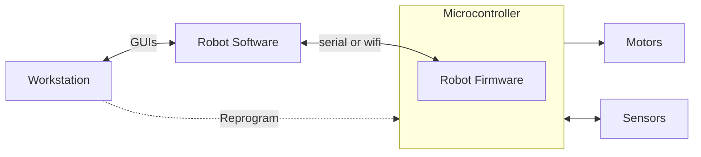
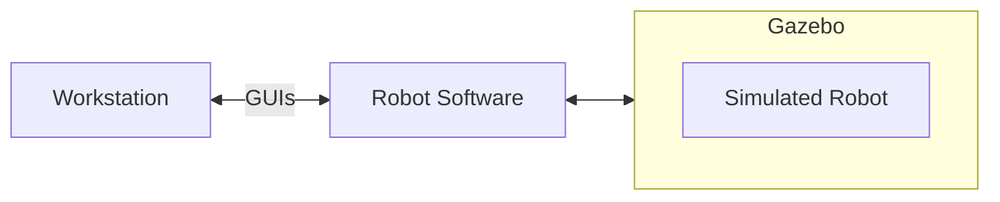
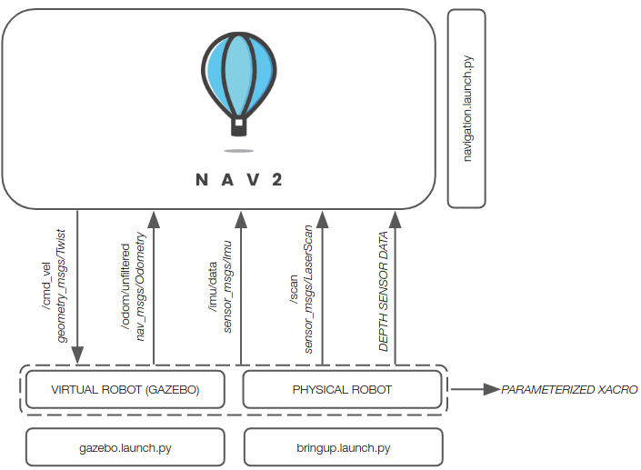
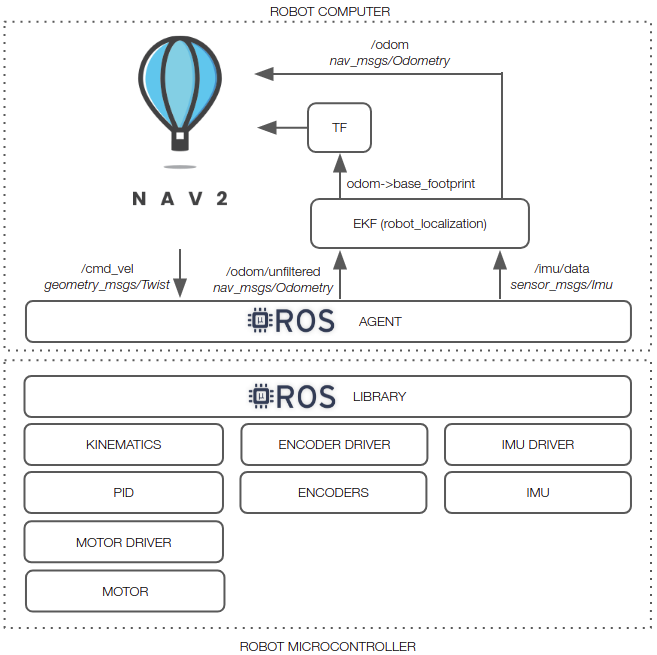
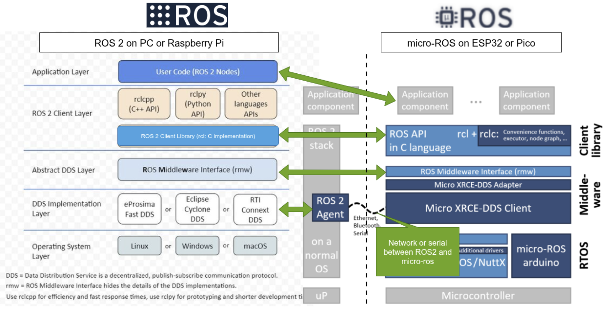

# Linorobot2 Architecture

## System Architecture

This section describes the system architecture within which a linorobot2 robot
runs.

### Physical Robot

The architecture of a system that includes a linorobot2 Physical Robot is shown below.

The Workstation provides the user a way to start Robot Software, as
well as to visualize the robot and its data using ROS GUI tools like
rviz and rqt. It also runs the Robot Firmware build system (PlatformIO),
and reprograms the Microcontroller with Robot Firmware updates.

The Robot Software includes linorobot2 packages from this repo, as
well as the Nav2 navigation packages and other ROS packages. It is ROS
software that runs the navigation algorithms that enable the robot to
make maps and autonomously navigate using them. Robot Software may run
on an onboard Robot Computer that uses a USB serial link to communicate
with Robot Firmware. Alternatively, it may run on the Workstation and
use wifi to communicate with Robot Firmware.

The Robot Firmware runs on the onboard Microcontroller, accepts motion
commands from Robot Software, and translates them into hardware actions
that turn the wheel motors. It also reads the sensors and passes their
data back to Robot Software. Robot Firmware runs high-frequency
real-time control loops with good predictability, offloading that task
from the Robot Computer.

### Simulated Robot

The architecture of a system that includes a linorobot2 Simulated Robot
is shown below.

As with the Physical Robot, the Workstation provides the user a way to
start Robot Software and the Gazebo physics simulator, as well as to
visualize the robot and its data using ROS GUI tools like rviz and rqt.

The Robot Software is the same as in a Physical Robot - it includes
linorobot2 packages from this repo, as well as the Nav2 navigation
packages and other ROS packages. It is the ROS software that runs the
navigation algorithms that enable the robot to make maps and autonomously
navigate using them. Robot Software and Gazebo may run on the Workstation,
or up in the cloud.

The Gazebo simulator runs a simulation of the robot and its interactions
with a simulated world. It has the same interfaces to Robot Software as
the Physical Robot.

The fact that Gazebo provides the same interfaces as the Physical Robot
enables it to simulate a "digital twin" of the Physical Robot. No changes
in Robot Software are needed to switch between the Physical Robot itself
and the Simulated Robot that mirrors the Physical Robot.

## Architectural Goals

The architectural goals of linorobot2 and linorobot2_hardware are
to enable ROS2 navigation, both on Physical Robot hardware and for
a Simulated Robot running in a gazebo simulation, for a variety of
differential-drive, skid-steer, and meccanum robots, and to do this with
a high degree of parameterization of robot hardware characteristics and
sensors and motor drivers.

This should result in reduced development effort for robot software
and firmware.

Physical Robot hardware includes a Microcontroller running low-level
high-frequency tasks in Robot Firmware and communicating to Robot Software
on a Robot Computer and/or Workstation using the micro-ros transport.
Micro-ros is central to the architecture, and enables Microcontroller
firmware to flexibly subscribe and publish to ROS topics on the Robot
Computer or Workstation, provide service servers, and generally be a
part of the ROS node graph.

The architecture includes extension points for users to add customizations
for their robots in such a way that they don't conflict with ongoing
maintenance and upgrades to the linorobot2 packages. This enables
upgrading linorobot2 software and firmware, hopefully with minimal impact
to the user's robot software and configurations in many cases.  Proper use
of extension points also enables users to give back upgrades to the core
linorobot2 software and firmware without disrupting their customizations.

Once the robot's URDF has been configured in the linorobot2_description
package, users can easily switch between launching the Physical Robot
and spawning the Simulated Robot in Gazebo.

## Architecture

The figure below shows the major subsystems and launch files for running
on real hardware and in simulation.

Assuming you're using supported sensors and motor drivers, linorobot2
automatically launches the necessary hardware drivers, with the topics
being conveniently matched with the topics available in Gazebo. This
allows users to define parameters for high level applications (ie. Nav2
SlamToolbox, AMCL) that are common to both virtual and physical robots.

The figure below summarizes the topics available after launching a connection to a hardware robot by running **bringup.launch.py**. It also shows the functions assigned to the microcontroller for physical robot control.

The diagram below shows a communication protocol stack view of Robot Software and
Robot Firmware, and how they relate.

TODO: 

- explain the protocol stacks, and where Robot Software and Firmware fit in them.
- Explain micro-ros
- Discuss C++ on Robot Software side vs C on firmware side, -> different APIs